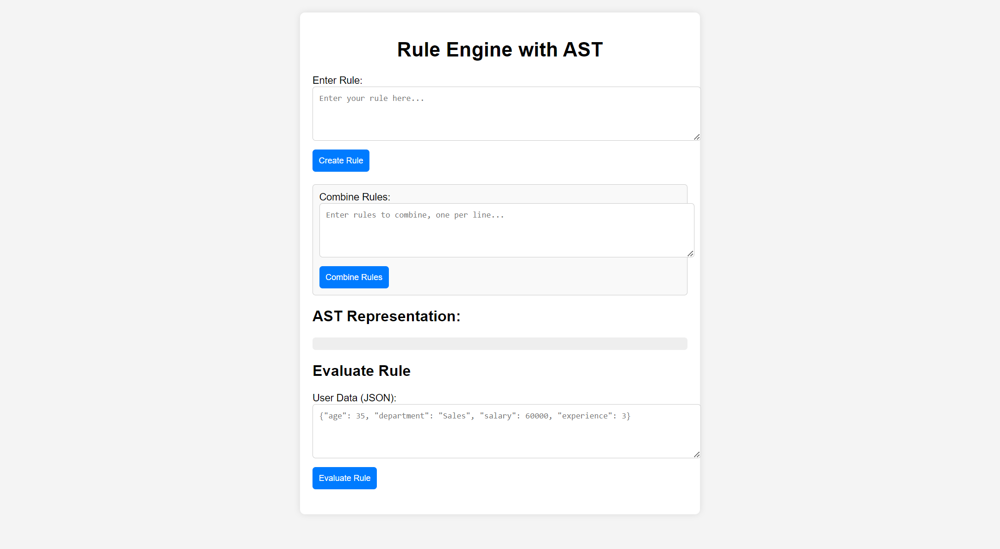
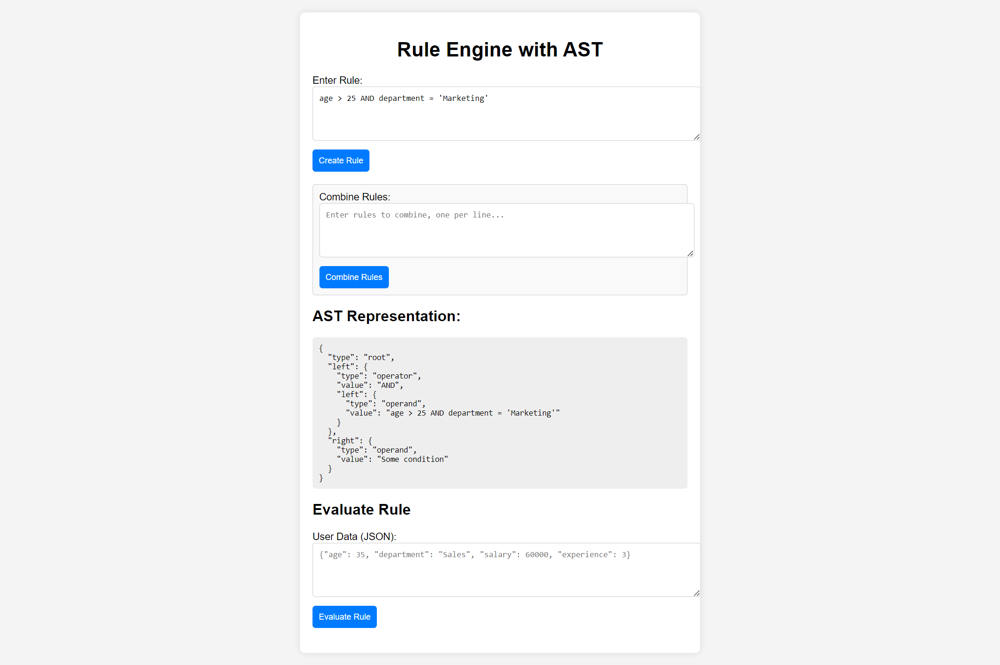
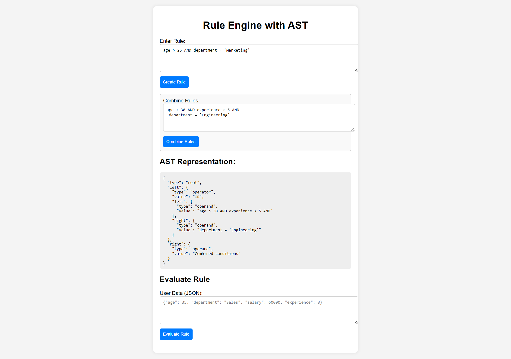
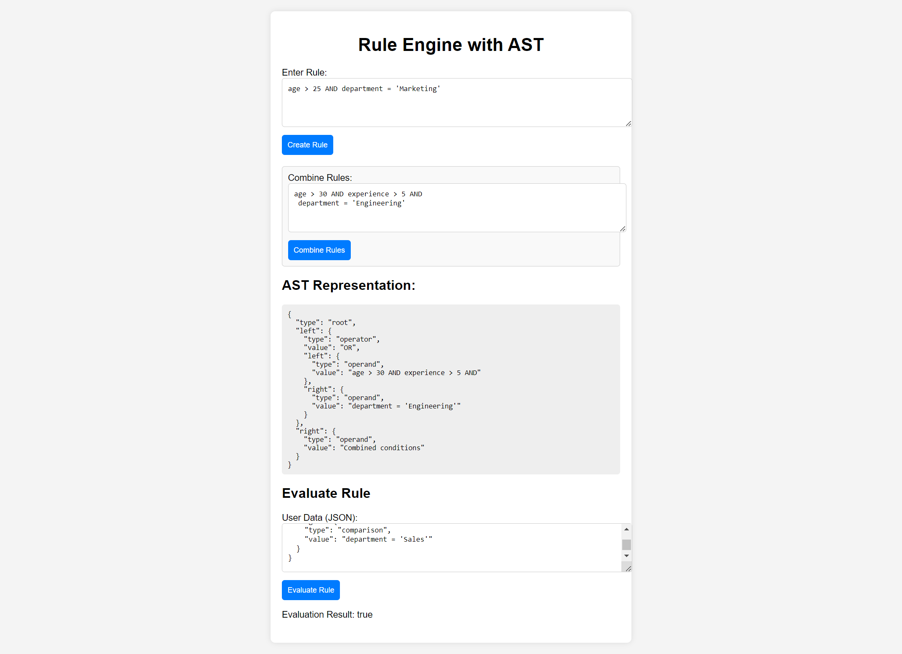

"# Rule-Engine-with-AST" 

 ## **Rule Engine Application** ##
  
This is a Rule Engine Application that allows users to create rules, combine them, and evaluate data against these rules. The rules are created using Abstract Syntax Trees (AST) for dynamic rule evaluation based on user attributes such as age, department, salary, and experience.

Landing page:

Create Rule:

Combine Rule:

Evaluating Rule:

**Additional description about the project and its features.**
.Table of Contents
.Features
.Technologies Used
.Installation
.API Endpoints
.Running the Application
.Testing with Postman
.Example Rules
.Frontend Integration
.Contributing
.License

  **Features**
Create Rules: Define custom rules based on user attributes.
Combine Rules: Combine multiple rules using logical operators.
Evaluate Rules: Evaluate user data against the combined rules to determine eligibility.
AST Representation: Use AST for dynamically modifying and evaluating rules.
    **Technologies Used**
Backend: Flask, Python
Frontend: HTML, CSS, JavaScript, Bootstrap (for UI)
Database: SQLite (if persistence is added)
Testing: Postman (for API testing)

  **Installation**
  
step 1: Clone the repository

https://github.com/YASIN0707/Rule-Engine-with-AST.git

cd rule-engine-app

Step 2: Set up a virtual environment and install dependencies:

python -m venv venv

source venv/bin/activate  # On Windows: venv\Scripts\activate

pip install -r requirements.txt

step 3: Run the Flask server:
cd backend

python app.py

The server should run on http://127.0.0.1:5500/.

API Endpoints
1. Create Rule
   
URL: POST /create_rule

Body:

{
  "rule": "age > 30 AND department = 'Sales'"
}

Response:

{
  "message": "Rule created successfully",
  "ast": "AST representation"
}

2. Combine Rules

URL: POST /combine_rules

Body:

{
  "rules": ["age > 30", "salary > 50000"]
}

Response:

{
  "message": "Rules combined successfully",
  "combined_ast": "Combined AST"
}

3. Evaluate Rule
   
URL: POST /evaluate_rule

Body;

{
  "data": {
    "age": 35,
    "department": "Sales",
    "salary": 60000,
    "experience": 3
  },
  "ast": {
    "type": "operator",
    "left": {...},
    "right": {...}
  }
}

Response:

{
  "is_eligible": true
}

Running the Application

Start the Flask backend:
python app.py

Access the frontend through a simple HTTP server or directly opening frontend/index.html.

**Testing with Postman**

You can test the API using Postman:

1.Open Postman.

2.Set the method to POST.

3.Use the following URLs for testing:

  .Create Rule: http://127.0.0.1:5500/create_rule
  
  .Combine Rules: http://127.0.0.1:5500/combine_rules
  
  .Evaluate Rule: http://127.0.0.1:5500/evaluate_rule
  
4.Send the appropriate JSON body in the request.

Example Rules

.Create Rule: age > 30 AND department = 'HR'

.Combine Rules
    .Rule 1: age > 25
    .Rule 2: salary > 50000
.Evaluate Rule:

  .User Data: { "age": 35, "salary": 60000, "department": "Sales" }
  .Combined AST from previous rules.
  
**Frontend Integration**
1.You can enter rules and data in the provided form in the frontend (located in frontend/index.html).
2.Use the buttons to create, combine, and evaluate rules via the API.
3.Results are displayed on the page after submitting the form.

**Contributing**

Feel free to submit issues and feature requests. Contributions are welcome! Fork the repository and create a pull request with your changes.

**License**

This project is licensed under the MIT License. See the LICENSE file for details.
MIT License

  
